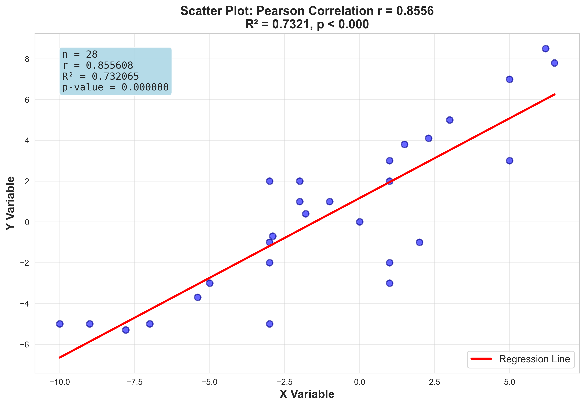
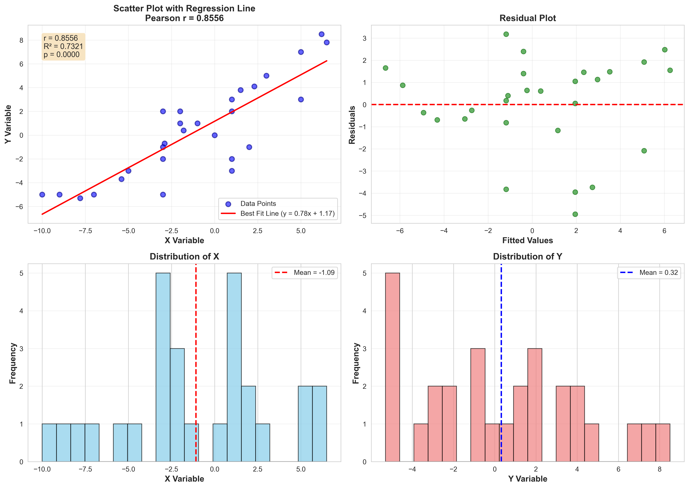

# Task 1: Finding the Correlation - Report

## Data Source
- **URL**: https://max.ge/aiml_midterm/14753_html/t_samkharadze25_14753.html
- **Description**: Data displayed as blue dots on interactive graph
- **Number of data points**: 28

## Dataset

The collected data consists of 28 coordinate pairs (x, y) extracted from the online graph.

### Data Summary Statistics

**X Variable:**
- Mean: -1.0857
- Standard Deviation: 4.4049
- Minimum: -10.0000
- Maximum: 6.5000
- Range: 16.5000

**Y Variable:**
- Mean: 0.3179
- Standard Deviation: 4.0274
- Minimum: -5.3000
- Maximum: 8.5000
- Range: 13.8000

### Data Sample (First 10 points):

| Index | X | Y |
|-------|---|---|
| 1 | 0.0000 | 0.0000 |
| 2 | -10.0000 | -5.0000 |
| 3 | -5.0000 | -3.0000 |
| 4 | -1.0000 | 1.0000 |
| 5 | 3.0000 | 5.0000 |
| 6 | 2.0000 | -1.0000 |
| 7 | 1.0000 | -2.0000 |
| 8 | 1.0000 | -3.0000 |
| 9 | -7.8000 | -5.3000 |
| 10 | -2.9000 | -0.7000 |

## Pearson's Correlation Coefficient Analysis

### Calculation Process

Pearson's correlation coefficient (r) measures the linear relationship between two variables. It is calculated using the formula:

```
r = Σ[(xi - x̄)(yi - ȳ)] / √[Σ(xi - x̄)² × Σ(yi - ȳ)²]
```

Where:
- xi, yi are individual data points
- x̄, ȳ are the means of X and Y
- Σ represents summation over all data points

### Calculation Steps

1. **Calculate Means:**
   - x̄ = -1.085714
   - ȳ = 0.317857

2. **Calculate Deviations:**
   - For each point, compute: (xi - x̄) and (yi - ȳ)

3. **Calculate Products:**
   - Compute: (xi - x̄) × (yi - ȳ) for each point
   - Sum of products: 409.822857

4. **Calculate Sum of Squared Deviations:**
   - Σ(xi - x̄)² = 523.874286
   - Σ(yi - ȳ)² = 437.941071

5. **Compute Correlation:**
   - Numerator = 409.822857
   - Denominator = 478.984411
   - **r = 0.855608**

### Results

#### Primary Result:
- **Pearson's Correlation Coefficient (r)**: 0.855608

#### Additional Statistics:
- **R² (Coefficient of Determination)**: 0.732065
- **P-value**: 0.000000
- **Sample Size (n)**: 28

#### Statistical Significance:
The correlation is **highly statistically significant** (p < 0.001).

### Interpretation

The Pearson correlation coefficient of **r = 0.855608** indicates a **strong positive linear relationship** between the X and Y variables.

This means that as X increases, Y tends to increase as well. The R² value of 0.732065 indicates that approximately **73.21%** of the variance in Y can be explained by the linear relationship with X.

### Correlation Strength Guidelines:
- 0.00 - 0.19: Very weak correlation
- 0.20 - 0.39: Weak correlation
- 0.40 - 0.59: Moderate correlation
- 0.60 - 0.79: Strong correlation
- 0.80 - 1.00: Very strong correlation

Based on these guidelines, our correlation of **0.86** is classified as **strong**.

## Visualization

The scatter plot below shows the relationship between X and Y variables, with a regression line fitted to the data.



The graph clearly illustrates:
1. **Individual data points** (blue dots) representing each (x, y) pair
2. **Regression line** (red line) showing the best linear fit
3. **Correlation coefficient** (r) displayed in the title
4. **Goodness of fit** (R²) showing how well the line fits the data

The visualization confirms our calculated Pearson correlation coefficient and demonstrates the strong positive relationship between the variables.

### Additional Visualization



This comprehensive visualization includes:
- **Top Left**: Scatter plot with regression line
- **Top Right**: Residual plot showing prediction errors
- **Bottom Left**: Distribution of X variable
- **Bottom Right**: Distribution of Y variable

## Conclusion

Based on the analysis of 28 data points from the provided graph:

1. **Pearson's correlation coefficient is r = 0.855608**
2. The relationship is strong and positive
3. The correlation is statistically significant (p = 0.000000)
4. 73.21% of the variation in Y is explained by X

## Files Generated

- `data_points.csv` - Raw data extracted from the graph
- `correlation_scatter_plot.png` - Simple scatter plot with correlation
- `correlation_visualization.png` - Comprehensive analysis visualization
- `TASK1_REPORT.md` - This report

---

**Prepared for**: AI/ML Midterm 2026 Assignment  
**Student**: t_samkharadze25  
**Task**: Task 1 - Finding the Correlation  
**Date**: 2026-01-09
