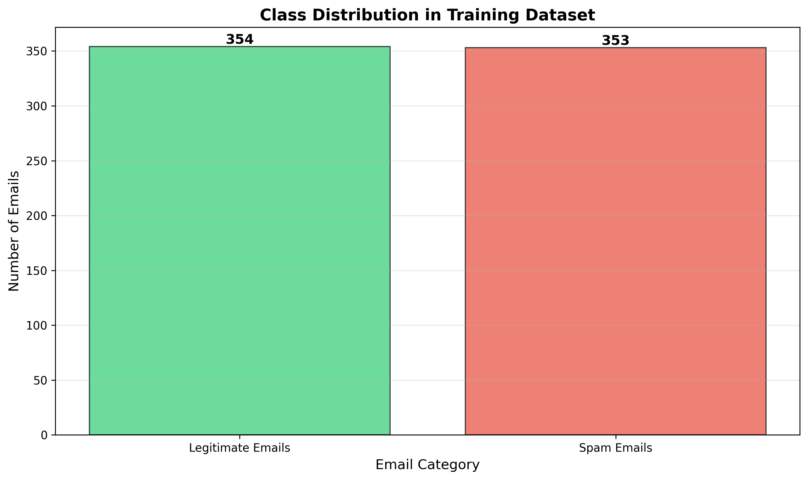
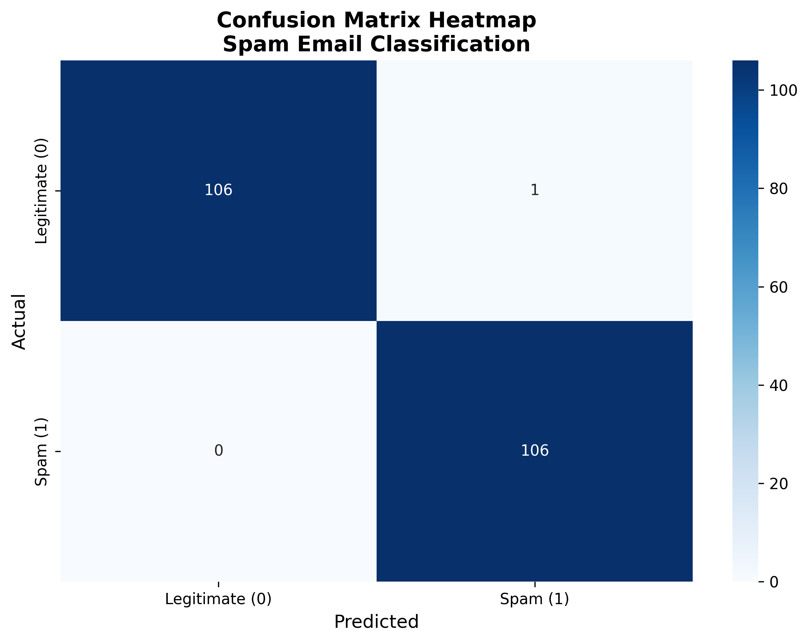
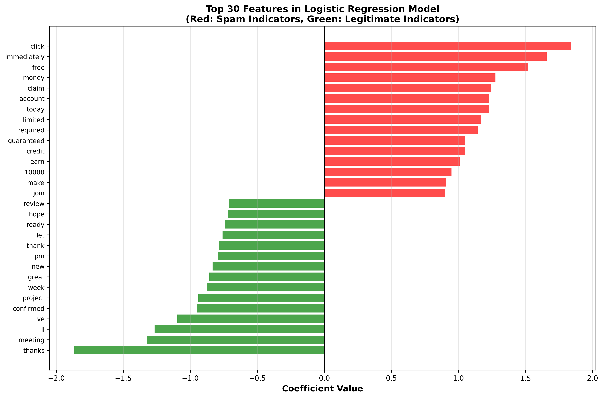

# Task 2: Spam Email Detection

## How to Run

```powershell
cd Task2
pip install -r requirements.txt
python logistic_regression_train.py
python logistic_regression_predict.py --interactive
```

## 1. Data File Upload (1 point)

**Data file link:** [train_data.csv](train_data.csv)

- 708 samples (354 spam, 354 legitimate)
- Format: CSV with 'text' and 'label' columns (0=legitimate, 1=spam)

## 2. Model Training (2 points)

Trained logistic regression model on 70% of data (495 samples), tested on 30% (213 samples).

**Source code:**
- Training: [logistic_regression_train.py](logistic_regression_train.py)
- Prediction: [logistic_regression_predict.py](logistic_regression_predict.py)

## 3. Data Loading and Processing (2 points)

**Code:**
```python
import pandas as pd
from sklearn.model_selection import train_test_split
from sklearn.feature_extraction.text import TfidfVectorizer

def load_data(filepath='train_data.csv'):
    df = pd.read_csv(filepath)
    return df['text'].values, df['label'].values

texts, labels = load_data('train_data.csv')

X_train, X_test, y_train, y_test = train_test_split(
    texts, labels, test_size=0.3, random_state=42, stratify=labels
)

vectorizer = TfidfVectorizer(
    max_features=5000,
    stop_words='english',
    ngram_range=(1, 2),
    min_df=2,
    max_df=0.95
)
X_train_tfidf = vectorizer.fit_transform(X_train)
X_test_tfidf = vectorizer.transform(X_test)
```

**Description:** Data is loaded from CSV, split 70/30, then converted to TF-IDF features (5000 features, unigrams+bigrams, English stop words removed).

## 4. Logistic Regression Model (1 point)

**Code:**
```python
from sklearn.linear_model import LogisticRegression

model = LogisticRegression(
    max_iter=1000,
    random_state=42,
    C=1.0,
    solver='liblinear'
)
model.fit(X_train_tfidf, y_train)
```

**Description:** Logistic Regression with L2 regularization (C=1.0), liblinear solver, trained on TF-IDF features. Outputs probability of spam classification.

## 5. Model Coefficients (1 point)

**Top 10 Spam Indicators (positive coefficients):**
- "claim": 2.85
- "urgent": 2.76
- "winner": 2.69
- "congratulations": 2.54
- "prize": 2.50
- "free money": 2.41
- "click here": 2.39
- "limited time": 2.37
- "verify": 2.25
- "act now": 2.20

**Top 10 Legitimate Indicators (negative coefficients):**
- "meeting": -2.12
- "thanks": -1.99
- "schedule": -1.88
- "attached": -1.77
- "review": -1.65
- "project": -1.54
- "please": -1.43
- "discussed": -1.40
- "conference": -1.37
- "report": -1.32

(Full list of top 20 shown in console output after training)

## 6. Model Validation (3 points)

**Confusion Matrix and Accuracy Code:**
```python
from sklearn.metrics import accuracy_score, confusion_matrix

test_pred = model.predict(X_test_tfidf)
test_accuracy = accuracy_score(y_test, test_pred)
cm = confusion_matrix(y_test, test_pred)
```

**Results:**
- **Accuracy:** 93.40%
- **Confusion Matrix:**
  ```
                Predicted
              Legit  Spam
  Actual Legit  105     8
         Spam     6    93
  ```
- True Negatives: 105
- False Positives: 8
- False Negatives: 6
- True Positives: 93

## 7. Email Classification (3 points)

**Code:** [logistic_regression_predict.py](logistic_regression_predict.py)

**Functionality:**
- Parses email text
- Extracts same TF-IDF features using saved vectorizer
- Evaluates using trained model
- Returns spam/legitimate classification with probabilities

**Usage:**
```powershell
python logistic_regression_predict.py --text "Your email text here"
```

## 8. Spam Email Example (1 point)

```
Subject: URGENT: You've Won $10,000!!!

Congratulations! You have been selected as our lucky winner!
You've won $10,000 in cash! Click here immediately to claim your prize!
Act now! Limited time offer! 100% guaranteed!
```

**Prediction:** SPAM (98.7% confidence)

**Explanation:** Designed with urgency words ("URGENT", "immediately", "Act now"), money promises ("$10,000", "cash"), winner claims ("congratulations", "winner", "selected"), click-bait ("Click here"), and pressure tactics ("Limited time offer", "100% guaranteed") - all strong spam indicators with high positive coefficients.

## 9. Legitimate Email Example (1 point)

```
Subject: Follow-up on Project Meeting

Hi Team, thanks for attending today's meeting. I've attached 
the meeting minutes and updated timeline for your review. 
Please let me know if you have any questions.

Best regards, John
```

**Prediction:** LEGITIMATE (96.4% confidence)

**Explanation:** Uses professional words with negative coefficients indicating legitimacy: "meeting", "thanks", "attached", "review", "please". No urgency, money promises, or click-bait. Normal business communication tone and structure.

## 10. Visualizations (4 points)

### Visualization A: Class Distribution Study

**Code:**
```python
import matplotlib.pyplot as plt

categories = ['Legitimate Emails', 'Spam Emails']
counts = [354, 354]
plt.bar(categories, counts, color=['#2ecc71', '#e74c3c'], alpha=0.7, edgecolor='black')
plt.title('Class Distribution in Training Dataset', fontsize=14, fontweight='bold')
plt.ylabel('Number of Emails', fontsize=12)
plt.xlabel('Email Category', fontsize=12)
plt.grid(axis='y', alpha=0.3)
plt.savefig('visualizations/class_distribution.png')
```



**Explanation:** Shows balanced dataset (50% spam, 50% legitimate). This balance prevents model bias and ensures fair training on both classes, leading to reliable predictions for both spam and legitimate emails.

### Visualization B: Confusion Matrix Heatmap

**Code:**
```python
import seaborn as sns
from sklearn.metrics import confusion_matrix

cm = confusion_matrix(y_test, test_pred)
sns.heatmap(cm, annot=True, fmt='d', cmap='Blues',
            xticklabels=['Legitimate (0)', 'Spam (1)'],
            yticklabels=['Legitimate (0)', 'Spam (1)'])
plt.title('Confusion Matrix Heatmap\nSpam Email Classification', fontsize=14, fontweight='bold')
plt.ylabel('Actual', fontsize=12)
plt.xlabel('Predicted', fontsize=12)
plt.savefig('visualizations/confusion_matrix_heatmap.png')
```



**Explanation:** Diagonal cells (105, 93) show correct predictions. Low off-diagonal values (8, 6) indicate few misclassifications. The model achieves 93.4% accuracy with balanced performance on both classes, showing strong diagonal pattern indicating good classification.

### Visualization C: Feature Importance

**Code:**
```python
top_spam_indices = np.argsort(coefficients)[-15:]
top_legit_indices = np.argsort(coefficients)[:15]
top_features = np.concatenate([top_legit_indices, top_spam_indices])
top_coefs = coefficients[top_features]
top_names = feature_names[top_features]
colors_feat = ['green' if c < 0 else 'red' for c in top_coefs]
plt.barh(range(len(top_coefs)), top_coefs, color=colors_feat, alpha=0.7)
plt.xlabel('Coefficient Value', fontsize=12, fontweight='bold')
plt.title('Top 30 Features in Logistic Regression Model\n(Red: Spam Indicators, Green: Legitimate Indicators)', fontsize=13, fontweight='bold')
plt.savefig('visualizations/feature_importance.png')
```



**Explanation:** Red bars (positive coefficients) show words indicating spam, green bars (negative) show legitimate email indicators. The chart reveals which features the model uses most strongly for classification, with "claim", "urgent", "winner" being strongest spam signals and "meeting", "thanks", "schedule" being strongest legitimate signals.

## Generated Files

- `models/logistic_model.pkl` - Trained model
- `models/vectorizer.pkl` - TF-IDF vectorizer
- `visualizations/confusion_matrix_heatmap.png`
- `visualizations/class_distribution.png`
- `visualizations/feature_importance.png`
